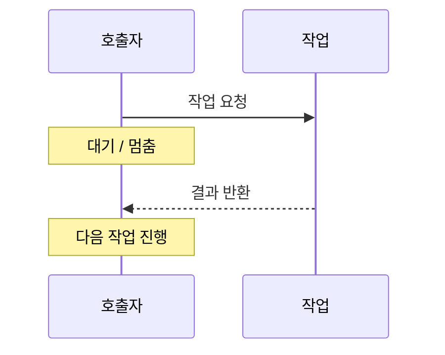
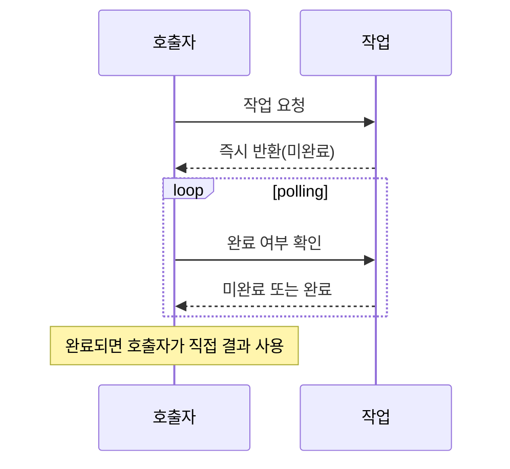
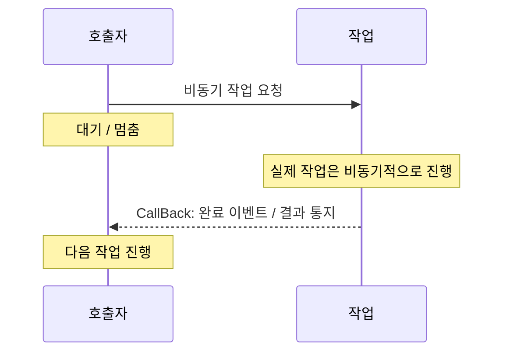
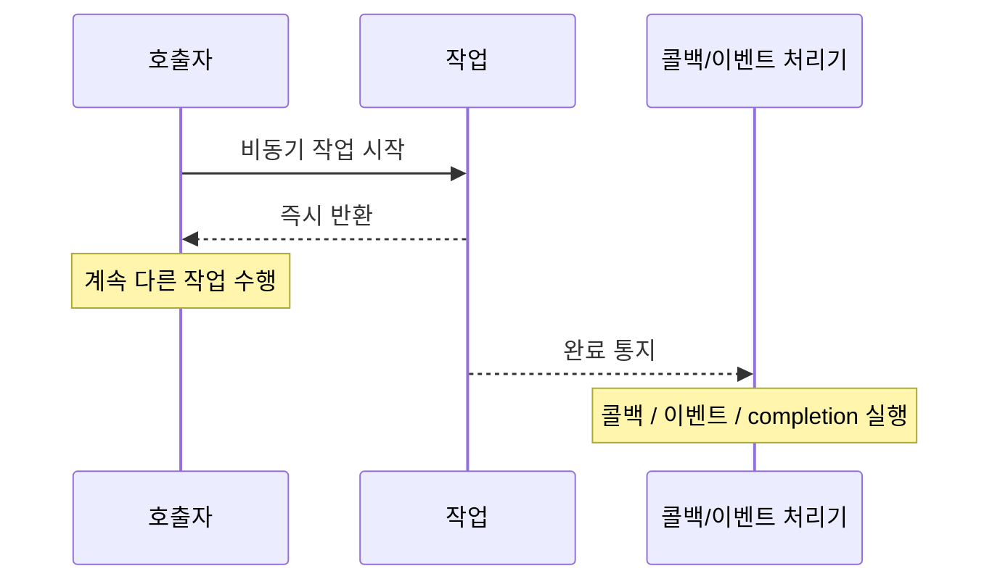

# Blocking / Non-Blocking / Sync / Async
블로킹, 논블로킹, 동기, 비동기에 대해서 공부한 내용을 작성하였다.

## 정의
### Blocking & Non-Blocking

**블로킹:** 작업 요청 시, 처리 결과를 응답받을 때까지 멈춘다.
- 작업 결과 확인 시, 확인이 될때까지 제어권을 넘겨받지 못한다.

**논블로킹:** 블로킹과 달리 요청에 대한 결과를 응답받을 때까지 '가만히 기다리지' 않는다.
- 작업 결과 확인 시, 확인 여부와 상관없이 제어권을 넘겨받는다.

### Synchronous & Asynchronous

**동기:** 호출자가 작업 완료를 확인해야 다음 작업을 진행할 수 있다. 
**비동기:** 호출자가 작업 완료를 확인하지 않아도 다음 작업을 진행할 수 있다. 

## 가능한 조합

### 동기 + 블로킹

- 작업 하나를 완료한 뒤, 그 다음 작업을 수행한다.
- 작업 요청 시, 처리 결과를 응답받을 때까지 멈춘다.

### 동기 + 논블로킹

- 작업 하나를 완료한 뒤, 그 다음 작업을 수행한다.
- 작업 요청 시, 처리 결과를 떠나 즉시 응답받는다.
    - **polling**을 통해 주기적으로 결과를 확인한다.
    - 따라서 polling 로직은 수행할 수 있다.

### *비동기 + 블로킹*

- 작업이 완료되지 않아도 다음 작업을 바로 진행할 수 있다.
- 작업 요청 시, 처리 결과를 응답받을 때까지 멈춘다.

⇒ 두 개념은 서로 상충되며, 마치 ‘동기 + 블로킹’ 방식처럼 동작하게 된다. 따라서 일반적으로는 사용되지 않는다. 개발자의 실수에 의해 발생하는 안티패턴으로 취급되기도 한다.

### 비동기 + 논블로킹

- 작업이 완료되지 않아도 다음 작업을 바로 진행할 수 있다.
- 작업 요청 시, 처리 결과를 떠나 즉시 응답받는다.
    - 각 작업이 완료될 때 콜백/이벤트 드리븐 등으로 제 3자가 이후 로직을 처리한다.
    - 제 3자는 원래 로직을 수행하던 스레드가 될 수도, 아예 별도의 스레드가 될 수도 있다.
    - 이 콜백을 별도의 스레드가 수행하는 경우, 호출(origin) 스레드의 thread-local을 사용할 수 없다.

---
*이미지 출처: [위키독스](https://wikidocs.net/168327), [Lifealong - Tistory](https://0soo.tistory.com/216)*